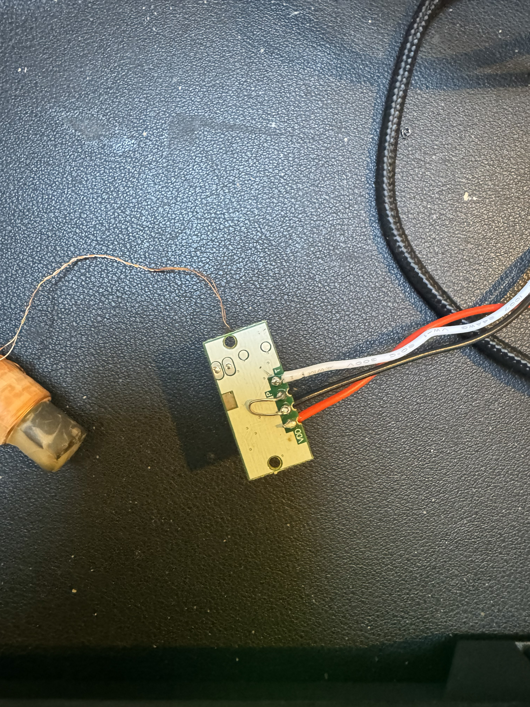

# DCF77-Clock

This is a simple DCF77-based clock that runs on a TTGo TDisplay and requires a simple and cheap receiving module such as [this one from AliExpress](https://s.click.aliexpress.com/e/_c3wt97PH).

At the moment it synchronises to the DCF signal and displays the time and date, albeit badly.

## Build instructions

### Physical

Feed the module 3.3V and GND from the ESP32 module, and  wire the data pin to pin 17 on the module. Then flash the firmware. 

The module needs an enable signal, which is active low. The easiest way to accomplish this is to tie it to GND. A quick and dirty hack is to strip a bit more of the GND wire and loop it through the enable signal as shown here:

### Software

This firmware image is being built using Platform.io. Use the Platform.io VScode extension to build and upload it to your module.